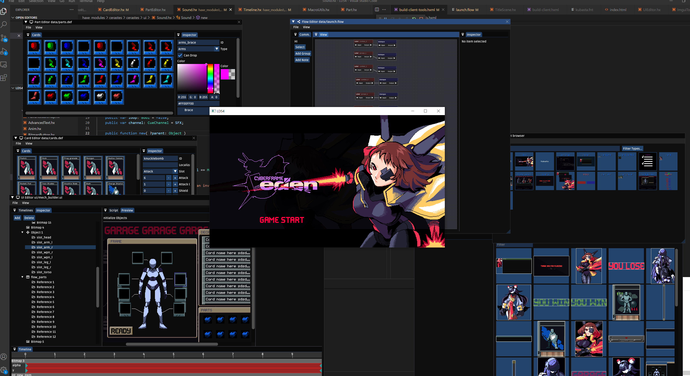

# Cerastes
Cerastes is a toolchain built in top of Heaps. It's open source and free to use, *but you probably shouldn't*. Read the documentation before you get started.

[Documentation](docs/index.md)

