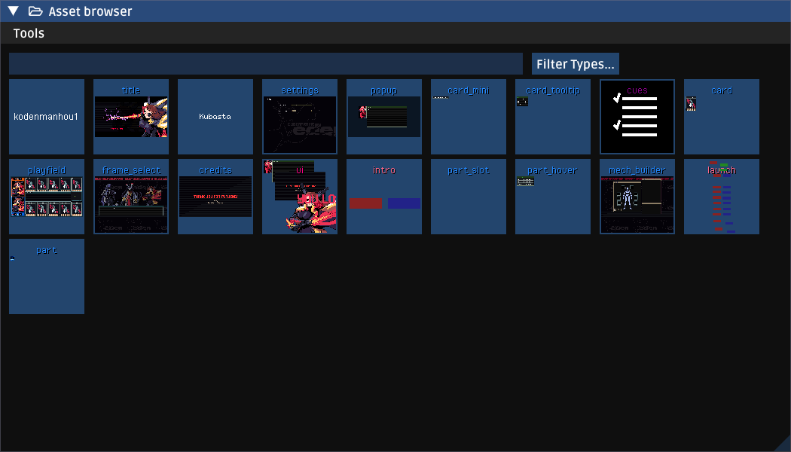
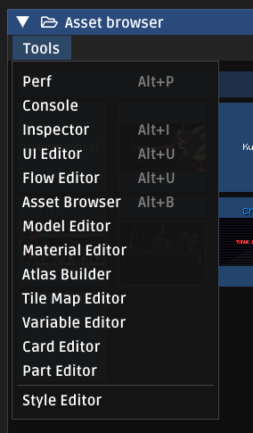

# Asset Browser
This is the only tool that can't be closed; it functions as a springboard for all other tools.



### Launching tools
The easiest way to launch a tool is to just open the related asset from the browser by double clicking it. You can quickly filter to an asset with the filter box. Additionally, "Filter Types" lets you show/hide particular asset types.



If you want to create a new asset, launch the editor from the tools menu.

### Adding your own tools.

Your game probably has some cool stuff that would benefit from its own tool. Tools should be subclasses of `cerastes.ImGuiTool`. You can register them by adding to `ImGuiToolManager.customTools` as such:

```haxe
ImGuiToolManager.customTools.push({
	extensions: ["coolext"],
	title: "My Cool Tool",
	cls: "game.tools.CoolTool"
});
```