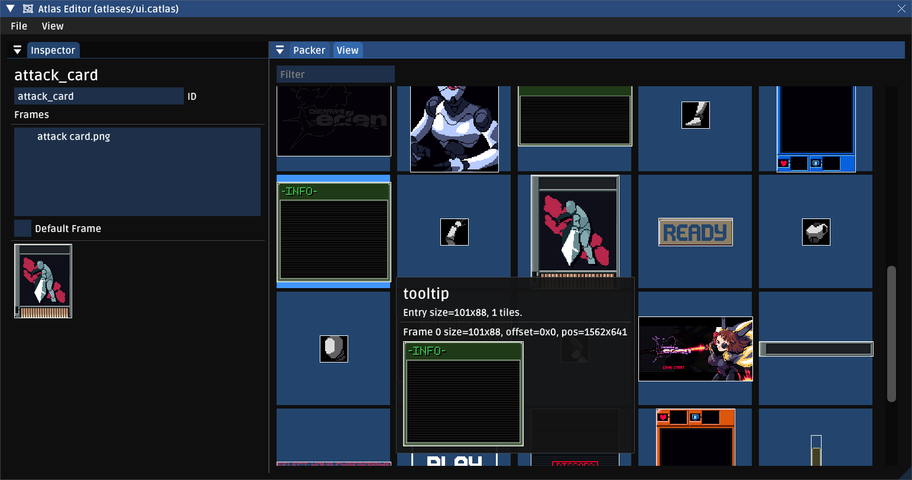

# Altas Builder
Cerastes uses its own internal atlas format. If you already have atlases sorted out, we still fully support Heaps' normal atlas format in a read-only format; you'll just need to bring your own packing tool.

## Why re-invent the wheel?
The main motivations for building our own format was to add functionality that the normal atlas system is missing. Specifically:
* **Per-frame animation timing**. Animations built with this tool can set individual timings on each frame, and this is a component of the animation instead of a parameter in `h2d.Anim`. In my mind, this makes a lot more sense than specifying it in code.
* **Sprite Trimming**. This was a feature request from my artist; they often create layers on sprites which have specific positioning; such as blinking eyes or a moving mouth. These are small slices of the full sprite that only cover what's being changed. Tather than building a tool that would force them to manually re-align things in engine, they export the layers in the same size as the sprite itself, and the atlas builder trims off the transparent pixels during packing.

## How does it work?
It's mostly just drag and drop, with a few caveats. **Sprites must be placed in `res/raw_sprites`.** This folder should be excluded from your pak file, it's only used to build the atlases at runtime.

Once this is done, you can simply drag sprites into the atlas builder UI. For animations, drag the first frame in, select it, and drag additional frames into the properties window's "Frames" box. To adjust timing, select a frame.

**Additional properties:**
* Skip trim: Mark this sprite to not be trimmed during packing. Sometimes this is desirable.
* Padding: Add a specific number of pixels to the sprite. This is sometimes necessary to deal with sampling errors when sprites are rotated.