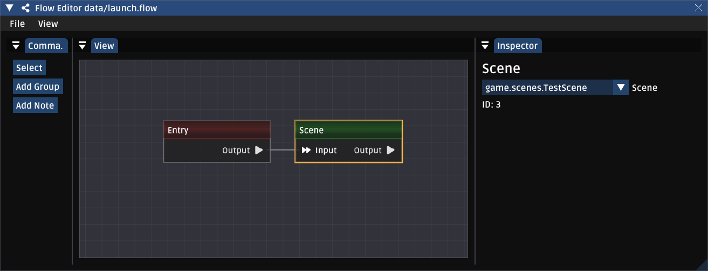
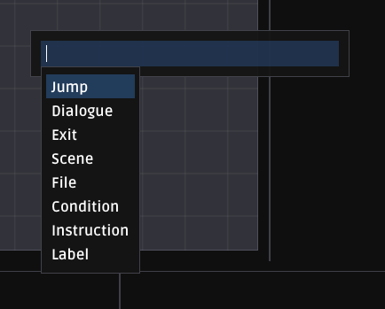
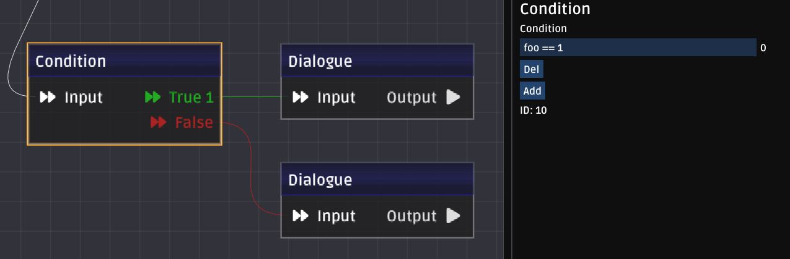
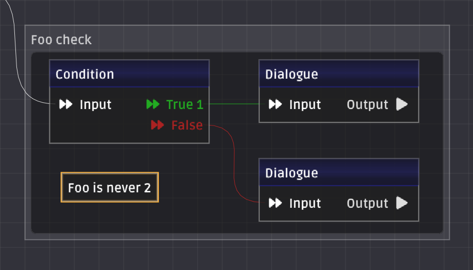

# Flow Editor
The first thing to understand about Flows is that it's a node-based system to control high level logic. The second thing to understand is that they are not, in any way, a replacement for code. Flows are explicitly *not* a replacement for blueprints, or any other visual scripting language. Instead, they should be thought of as a system for organizing how scenes are connected, building dialogue trees, and as endpoints for internal logic events.

## launch.flow
By default, the game will run this file at startup, once preload completes. Most launch files will be extremely simple, though they're a good place to add debugging complexity to, for example, jump directly to a scene or dialogue section if you wanted to quickly do that.


## Making a new node
The easiest way is to simply drag from a pin's `output` to an empty part of the grid. This will create a new node connected to the node you dragged from. With this widget, you can type to filter and press enter, select with arrow keys, or select with the mouse; whichever is most convenient for you.


## Conditions
Condition nodes are the bread and butter to putting logic into your flows. In this example, we make a dialog condition based on the value of `foo`. Flow variables are explained later in this section.


## Organization
Sometimes you want to add a logical grouping to sections or nodes, or leave nodes. The controls on the left will let you place these types of nodes. Groups are drawn as a box area, nodes are placed as a single node.


## Variables
You can pass variables into flows through a few different means. Most of these are done in `GameState`. While the sample doesn't currently have all of this plumbed, normally these are set in the `GameConfig`, which is designed to be loaded from disk. This lets people add/edit/remove variables without recompiling the game; useful if you have a writer who wants to make script edits but doesn't need/want to have a full IDE setup.

## Code API
You'll find situations where you want to jump to nodes or files from other places. This can be done via the `GameState.flow` object.

#### Jumping to a different node inside the current file
`GameState.flow.jump("foo");`

#### Jumping to a different file
`GameState.flow.jumpFile("data/foo.flow");`
This additionally can take a nodeId or label to jump to, which is useful if you have a responses file you want to index into.

#### Queueing a node
Sometimes you want to set the next node without actually jumping; for example if you're inside dialogue, jumping may break your game state, but queueing will let the dialogue naturally finish and execute any outputs before going to your target node.
`GameState.flow.queue( targetNode );`

### Making your own nodes
See `data/Flow.hx` and `data/Config.hx` for full examples.

First, create a new subclass of `FlowNode`. Make sure this is included in your compile path, you may need to add `--macro include("path.to.module")`.
```haxe
 class DialogueNode extends FlowNode
 {
	 @editor("Dialogue","StringMultiline")
	 public var dialogue: String;

	 public override function process( runner: FlowRunner )
	 {
		trace("Hello~");
		nextAll(runner);
	 }

	 #if hlimgui
	 static final d: NodeDefinition = {
		 name:"Dialogue",
		 kind: Blueprint,
		 color: 0xFF222288,
		 pins: [
			 {
				 id: 0,
				 kind: Input,
				 label: "\uf04e Input",
				 dataType: Node,
			 },
			 {
				 id: 1,
				 kind: Output,
				 label: "Output \uf04b",
				 dataType: Node
			 }
		 ]
	 };

	 override function get_def() { return d; }
	 #end
 }
```
For simple nodes, the `@editor` markup will do all the heavy lifting in imgui. The first argument is the label, the second argument is the imgui control type.
Valid types are:
* Bool
* Int
* String (or LocalizedString)
* StringMultiline (or LocalizedStringMultiline )
* Tile
* File
* Array (Requires a third argument for type, currently only String is accepted)

`NodeDefinition` must be defined in all node children. This defines the inputs and outputs, gives the node a name, and other basic configuration.

`process` controls what happens with the node is hit. Nodes *do not* need to immediately call `next` functions, a common pattern here is to fire a callback and, if handled, let the listeners handle calling `next` when they're ready. See `cerastes/flow/Flow.hx` for more examples.

Note that *every field you add to a flownode will be serialized*. If you want to have a temporary field that is not written to disk, you should add the `@noSerialize` metadata to it.