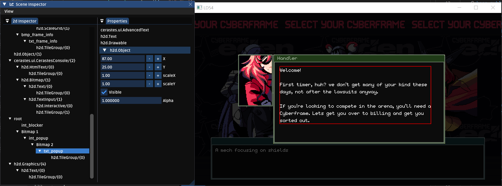

# Inspector

The inspector lets you quickly peek into the current state of the game, and make simple live edits. These are *non-persistent*, similar to editing a live object in Unity. The main goal of the inspector is to help debug the state of the game, and answer questions like "Why can't I see X", "is Y visible", etc.



Hovering over an element will draw its bounds in the live game scene. Clicking on it will let you view and adjust a subset of properties.

### Adding custom controls
`UIEntities` may want to support runtime modifications or tools on top of the default inspector options. Simply override the  `sceneInspector` function to add these controls.

Example:
```haxe
public override function sceneInspector( o: UIEntity )
{
	if( ImGui.checkbox("foo", foo ) )
		set_foo( foo );

	// Additionally, it may be useful to call getInspector( def ); here!

	// Don't forget to chain to base
	super.sceneInspector(o);
}
```