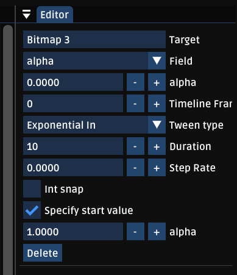
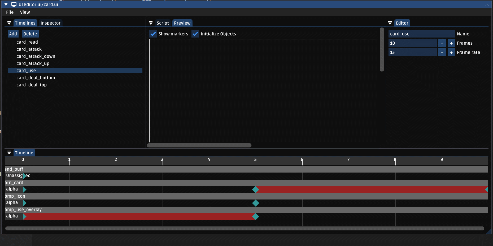

# UI Editor
The goal of the UI editor is to cut out the "nudge it left a few pixels and rebuild" flow that I often found myself falling into. It comes with a bunch of related systems to make UI extension easier to work with.

## Overview
The UI editor can be broken up into two "modes". The main path is via the inspector; it lets you add, editor, move, and delete items to the tree.


Items in the inspector can be drag/dropped, and right clicking will allow you to clone a node, or entire tree of nodes. Clicking on a node will select its properties in the right hand pane.

## Timelines
Timelines are basically short animation sequences that UI can perform. These are useful for UI state transitions, and general juice. The workflow for this is a BIT goofy, so bear with me.

1) Create a new timeline by selecting the "timelines" pane on the right, then selecting "add". Once you select the timeline, you can now add keyframes by going *back to the inspector*, right clicking on a node, and selecting "Keyframe here".



`Target` is the ID of the UI element we want to affect
`Field` is the field we want to modify. This will affect the rest of the UI accordingly.
If you set `Tween type`, you can specify a tween. Tweens should have a duration of *at least 1 frame* or they won't do anything. You can also specify a start value, else the current value will be used.

You can select, move, and modify keyframes from the keyframe view at the bottom.

The *space bar* will play/pause the currently selected timeline.



## Custom UI
You're probably going to need to do some custom logic in a UI element at some point. You can create custom `UIEntities`, which can then be selected by creating an empty `h2d.Object`, selecting it, and changing it's type in the properties section.

```haxe
@:structInit class ExampleElementDef extends CUIObject
{
	public var foo: Int = 0;
}

@:keep
@:build(cerastes.macros.UIEntityBuilder.build( ExampleElementDef ))
@:build(cerastes.macros.Callbacks.CallbackGenerator.build())
class ExampleElement extends UIEntity
{
	#if hlimgui
	@:keep public static function getInspector( def: ExampleElementDef ) {
		ImGui.inputInt("Example Int", def.foo );
	}
	#end

	@:obj public var ctnContainer: Object;

	public override function initialize( root: h2d.Object )
	{
		super.initialize(root);
		cerastes.macros.UIPopulator.populateObjects();
	}

	public override function onAdd()
	{
		super.onAdd();

		if( !initialized )
			return;

		trace("I got added!");
	}

}
```

There's a lot going on here so lets break it down a bit.

`ExampleElementDef` is the container object that's used for serialization. Anything we want to store to disk about this element, we need to put in here. These are the things we're probably going to want imgui controls for. We use `getInspector` to generate the custom imgui properties page. Unlike flow, this is a manual process for now.

`initialize` calls `cerastes.macros.UIPopulator.populateObjects();`. This is what sets up the `ctnContainer` variable; essentially this macro and meta pairing will automate the process of finding `ctn_container` in our UI file and binding it to the `ctnContainer` property in the object. This isn't necessary if you don't need the auto binding feature, but it's generally convenient!

If binding works correctly, we set `initialized` to true, so we check this later in our `onAdd`. Note that by default, a text warning will be shown in the element if a missing element causes initialization to fail. This lets the user know that a certain element is expected inside this custom UI. You could do this automatically in code, but letting the implementer decide where in the tree the element goes is generally more flexible. You can also have custom UI automatically include another UI file, these checks would simply ensure that custom file is setup properly.

## Code API

#### Creating a UI element from disk
`var obj = hxd.Res.loader.loadCache( fileName, CUIResource ).toObject();`

#### Playing a timeline
```haxe
timeline = createTimelineRunner("open");
timeline.play();
```
